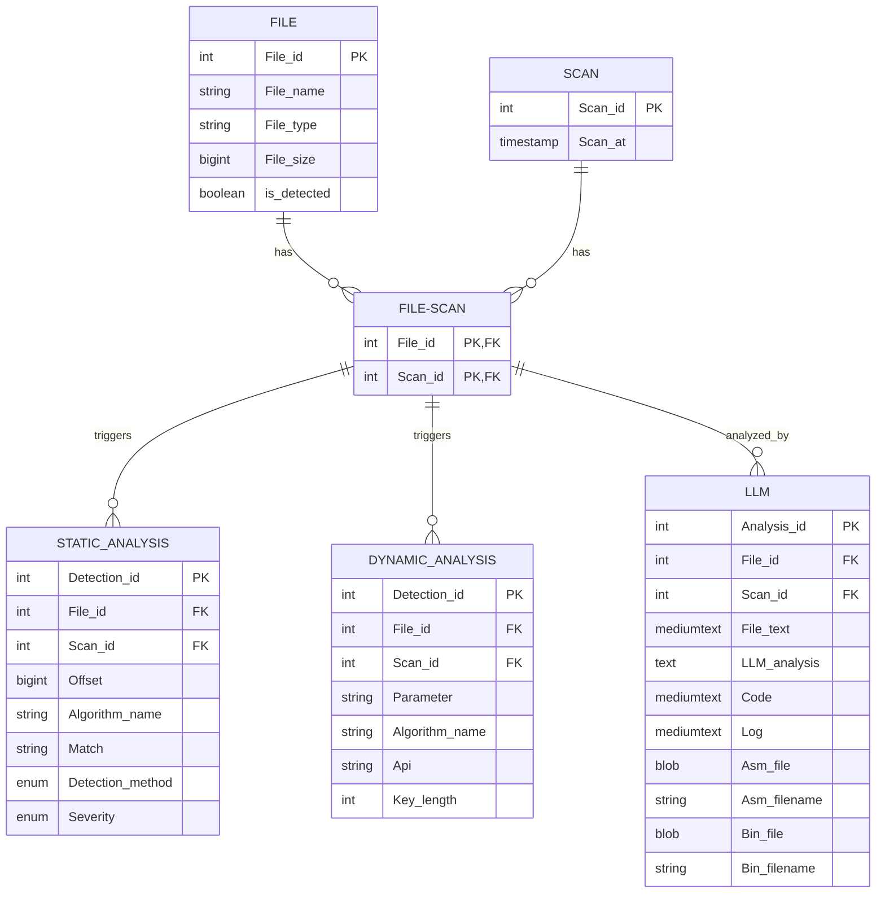

## Database ERD

```mermaid
erDiagram
    FILE ||--o{ FILE-SCAN : "has"
    SCAN ||--o{ FILE-SCAN : "has"
    FILE-SCAN ||--o{ STATIC_ANALYSIS : "triggers"
    FILE-SCAN ||--o{ DYNAMIC_ANALYSIS : "triggers"
    FILE-SCAN ||--o{ LLM : "analyzed_by"

    FILE {
        int File_id PK
        string File_name
        string File_type
        bigint File_size
        boolean is_detected
    }

    SCAN {
        int Scan_id PK
        timestamp Scan_at
    }

    FILE-SCAN {
        int File_id PK, FK
        int Scan_id PK, FK
    }

    STATIC_ANALYSIS {
        int Detection_id PK
        int File_id FK
        int Scan_id FK
        bigint Offset
        string Algorithm_name
        string Match
        enum Detection_method
        enum Severity
    }

    DYNAMIC_ANALYSIS {
        int Detection_id PK
        int File_id FK
        int Scan_id FK
        string Parameter
        string Algorithm_name
        string Api
        int Key_length
    }

    LLM {
        int Analysis_id PK
        int File_id FK
        int Scan_id FK
        mediumtext File_text
        text LLM_analysis
        mediumtext Code
        mediumtext Log
        blob Asm_file
        string Asm_filename
        blob Bin_file
        string Bin_filename
    }
```